<h1 align="center">🤖 Android Interview Prep</h1>

<p align="center">
  <strong>A study site that turns Android interview prep into something you <em>do</em>, not something you scroll.</strong><br>
  629 sourced items · 13 tracks · spaced repetition · runnable Kotlin · timed mocks.
</p>

<p align="center">
  <a href="https://nadernabil216.github.io/InterviewPrep/"><strong>▶ Open the site</strong></a>
</p>

<p align="center">
  
  
  
  
</p>

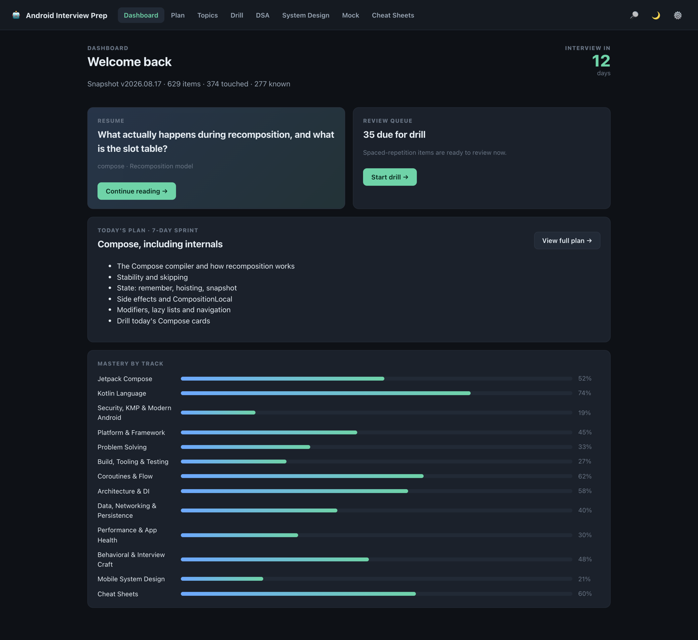

Nothing to install, no sign-up, no account. Open the link, and everything you do — what you've read,
what you've rated, your notes, your plan — is saved in your own browser and stays there. After the
first visit it works with the network off: on a plane, on a train, in the lobby ten minutes before
the call.

---

## Start here — your first 5 minutes

**1. Open the site.** It loads your whole library once, then opens instantly forever after.

**2. Tell it when your interview is.** ⚙️ Settings → *Interview date*. The dashboard turns that into
a countdown, and the countdown is what makes you choose the right plan instead of the comfortable one.

**3. Pick how you'll study.** Go to **Plan** and choose one of three modes:

| If your interview is… | Choose | Roughly |
|---|---|---|
| next week | **7-day sprint** | ~130 min/day, highest-yield material only |
| in two to three weeks | **15-day deep plan** | ~90 min/day, full coverage at senior depth |
| further out, or you're topping up | **Free study** | no schedule — follows your weakest tracks and what's due |

**4. Press *Start plan today*** and work the first day's tasks. Every task links straight to real
material, so there is never a "what do I read now?" moment.

**5. Come back tomorrow.** The dashboard tells you what's due before it tells you anything else.

---

## What's actually inside

### Every question is written three ways

That's the whole idea. Interviews don't test whether you've read something — they test whether you
can *say* it, and whether you avoid the specific mistakes that make an interviewer stop listening.

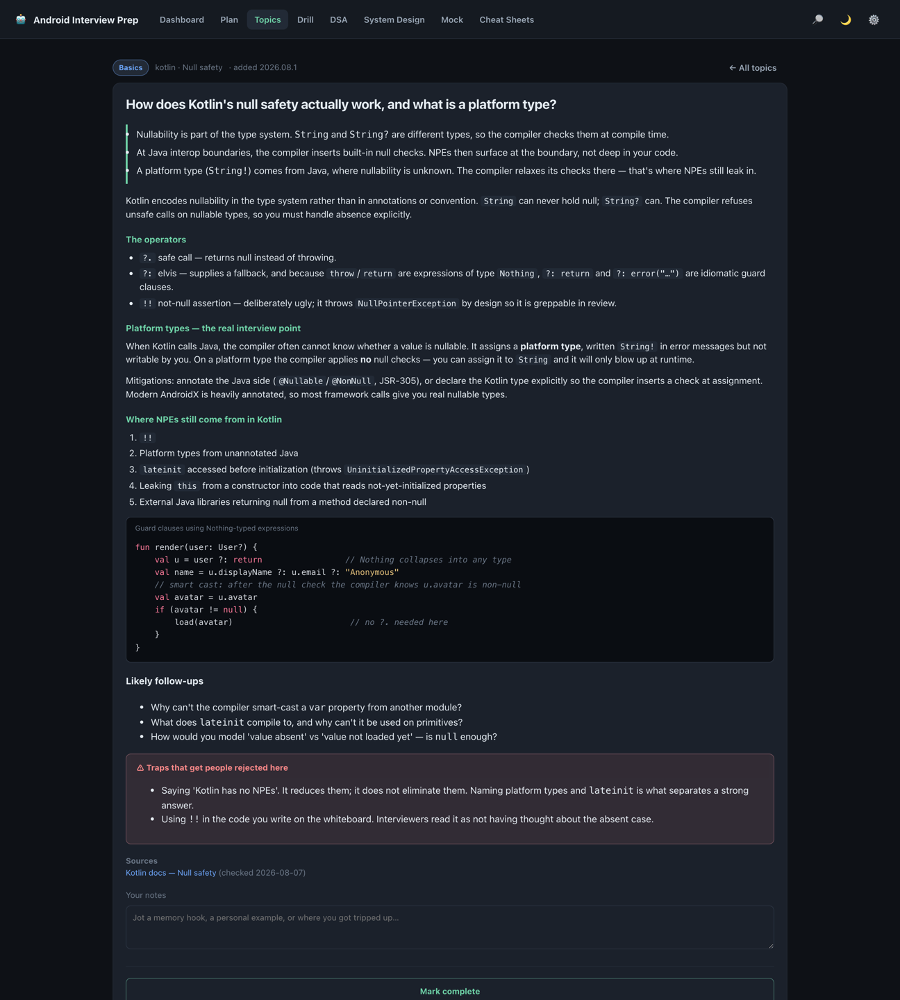

| Layer | What it's for |
|---|---|
| **Short answer** | What you'd actually say out loud in the room. 2–4 lines. If you can deliver this, you can move on. |
| **The full answer** | The depth behind it — the "why", the mechanics, the trade-offs an interviewer probes for. |
| **⚠ Traps** | The specific things that get candidates rejected on this exact question. |
| **Kotlin snippets** | Real code, syntax-highlighted, not screenshots of code. |
| **Likely follow-ups** | The interviewer's *next* question, so you're never surprised by it. |
| **Sources** | A dated link for every version- or date-bearing claim. You can always check the receipts. |
| **Your notes** | A box on every item for your own memory hook or personal example. |

### The 13 tracks

| Track | Items | What it covers |
|---|--:|---|
| **Kotlin** | 70 | Null safety, classes & data modeling, generics, delegation, properties & initialization, Java interop |
| **Coroutines & Flow** | 55 | Suspend mechanics, structured concurrency, cancellation, dispatchers, Flow operators, channels, testing |
| **Compose** | 75 | Recomposition model, stability & skipping, state, side effects, phases, snapshot system, navigation, lists |
| **Platform** | 60 | Lifecycle, process death, background work, permissions, IPC & Binder, behavior changes, notifications |
| **Architecture** | 50 | App architecture, domain layer, modularization, DI, offline-first, events & navigation |
| **Data & Networking** | 40 | Networking, serialization, Room, persistence, paging, key-value storage, image loading |
| **Performance** | 40 | Startup, jank, ANRs, memory, battery, app size, profiling, Android Vitals |
| **Build & Testing** | 60 | Gradle & AGP, dependency resolution, variants, signing, R8, test types & doubles, CI gating |
| **Security, KMP & Modern** | 70 | Keystore, biometrics, Play Integrity, network security, KMP & Compose Multiplatform, on-device AI, Play policy |
| **Problem Solving (DSA)** | 60 | 54 patterns in Kotlin, progressive hints, a runnable scratchpad |
| **Mobile System Design** | 19 | One reusable framework + 18 timed scenarios with rubrics |
| **Behavioral** | 25 | STAR structure, conflict, ownership, failure stories, your questions for them |
| **Cheat Sheets** | 5 | Printable one-pagers for the morning of |

Every item is tagged **Basics · Mid-Level · Senior · Lead**, so you can aim at the level you're
actually interviewing for instead of drowning in either trivia or staff-level abstractions.

### It stays current by itself

The library carries a version stamp, a matrix of current tool/platform versions, and **956 dated
source links**. When the content is refreshed, your device picks it up on its own and tells you with
a small toast — there's no update button to hunt for, and **your progress is never touched by it.**

---

## The screens, and what each one is for

### 📊 Dashboard — start every session here

Resume the last thing you read, see what's due, and watch mastery per track fill in. The 🌙 button
cycles dark → light → auto:

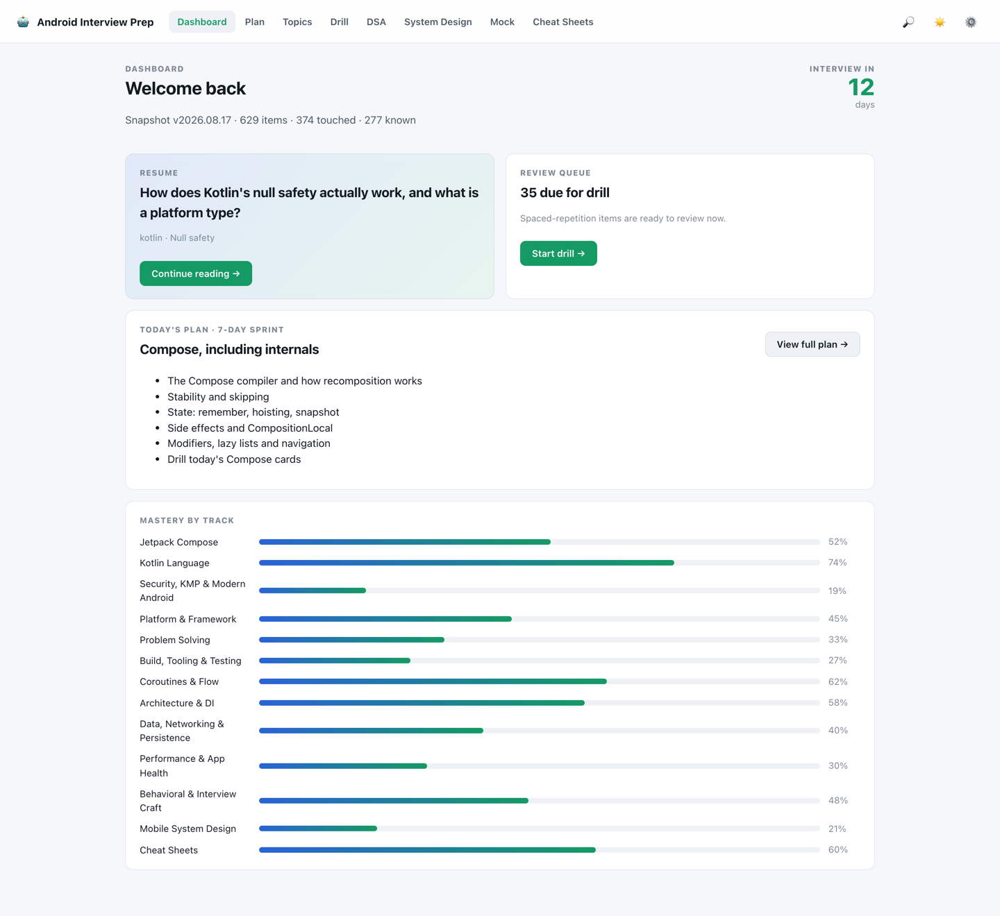

### 🗓 Plan — your day, decided for you

The 7-day and 15-day plans are day-by-day task lists. A task **ticks itself** once you've rated
everything it links to, so the plan reflects reality rather than optimism. Fell behind? *Shift to
today* moves Day 1 to today **without losing a single tick**.

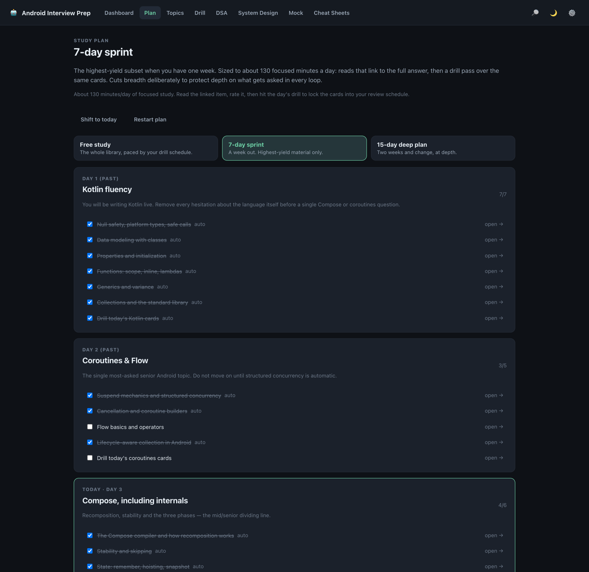

### 📚 Topics — browse and filter everything

Filter by keyword, track, level, or your own status — including **✨ New in this release**. The dot
on each row is where you stand: blue = not started, amber = learning, red = due for review, green =
known.

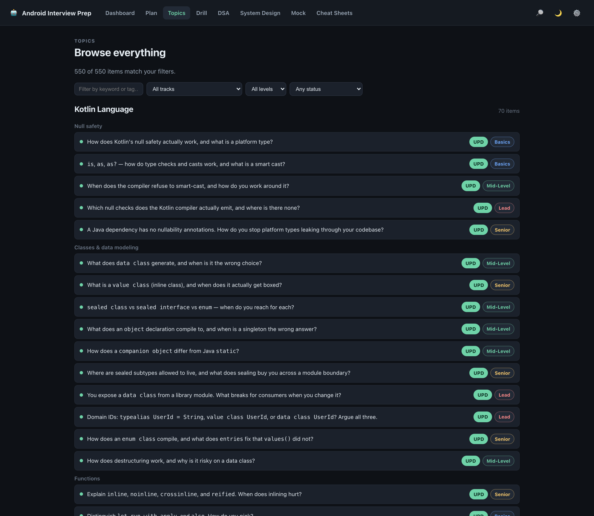

### 🔁 Drill — the part that actually makes it stick

Question first. Say your answer **out loud**, press <kbd>Space</kbd> to reveal, then *Mark complete*.
Each card comes back on a spacing schedule: one day, then a few, then weeks — so you review things
right before you'd have forgotten them, and stop re-reading what you already know.

The session clock *freezes* while an answer is on screen, so your per-card time measures recall, not
reading speed.

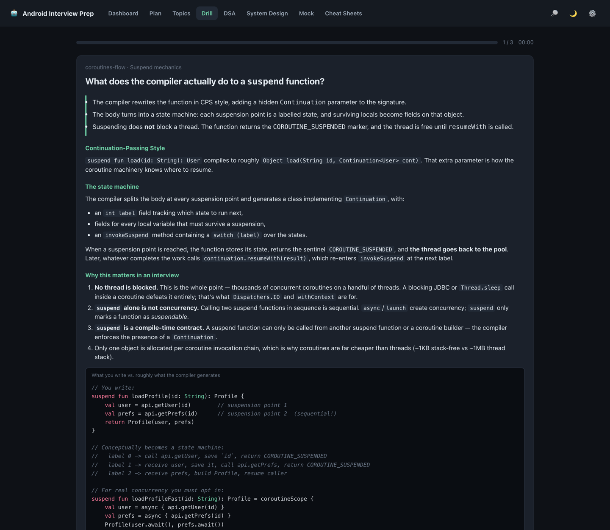

### 💻 DSA — 60 problems you can actually run

Prompt and progressively-gated hints on the left, your Kotlin scratchpad on the right. Press
**▶ Run** and your code executes against the problem's sample case for real — no account, no API key,
no setup. Output, compile errors and timeouts all come back into the panel.

Use the hints one at a time, and only after you're genuinely stuck. Reveal the solution last.

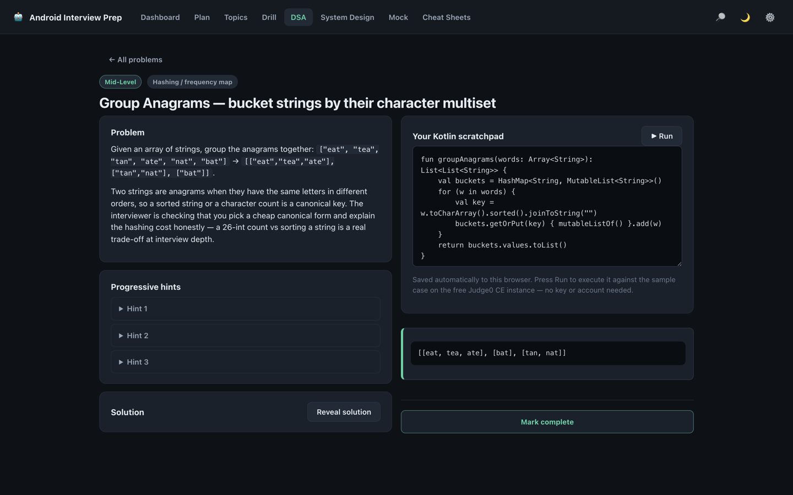

### 🏗 System Design — clarify first, then design

Every scenario opens in **Phase 1 — Clarify**: the questions you should be asking *before* proposing
anything. The reference architecture stays hidden until you press *Proceed to plan* — because
designing before asking is one of the most common ways strong candidates lose the round.

Then you get a timer, a requirements checklist to tick as you cover things out loud, a self-score
rubric, and a "what a staff-level answer adds" section.

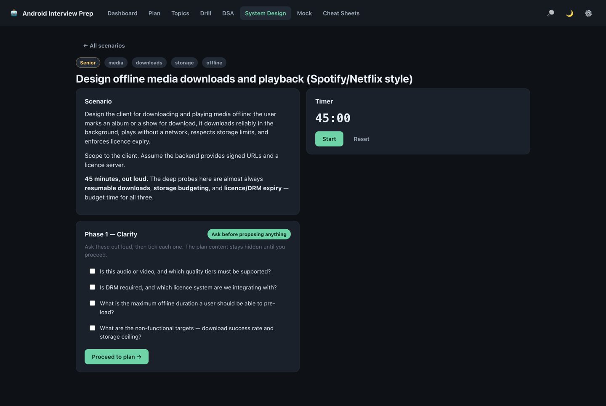

### 🎤 Mock — rehearse the real day

Four modes: **Android screen** (45 min), **System design** (45), **Coding** (45), or the **Full loop**
(135 min, all three back to back). Results are saved so you can watch the trend across attempts.

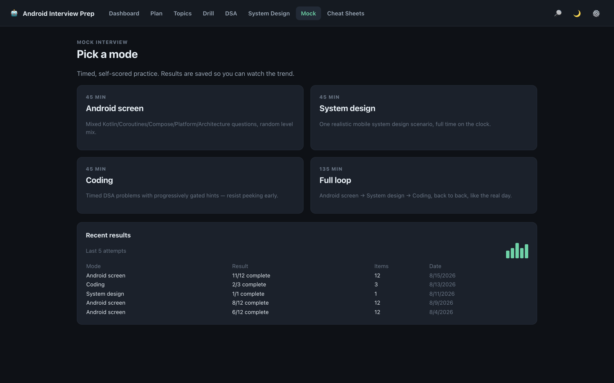

### 📄 Cheat Sheets — the morning-of skim

Printable one-pagers: the current version matrix, coroutines & Flow, Compose phases and effects,
Android 13→17 behavior deltas, and Gradle/AGP/R8 flags. *Print / Save as PDF* is built in.

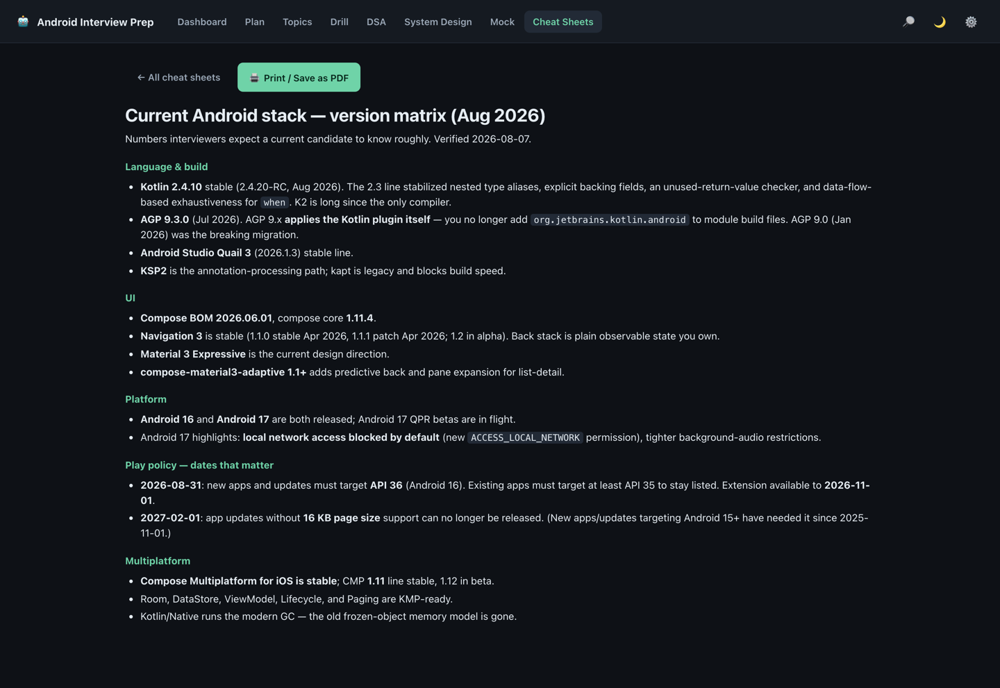

### 🔎 Search — press <kbd>/</kbd> anywhere

Instant search across every question, topic, track and tag. This is the fastest route to anything.

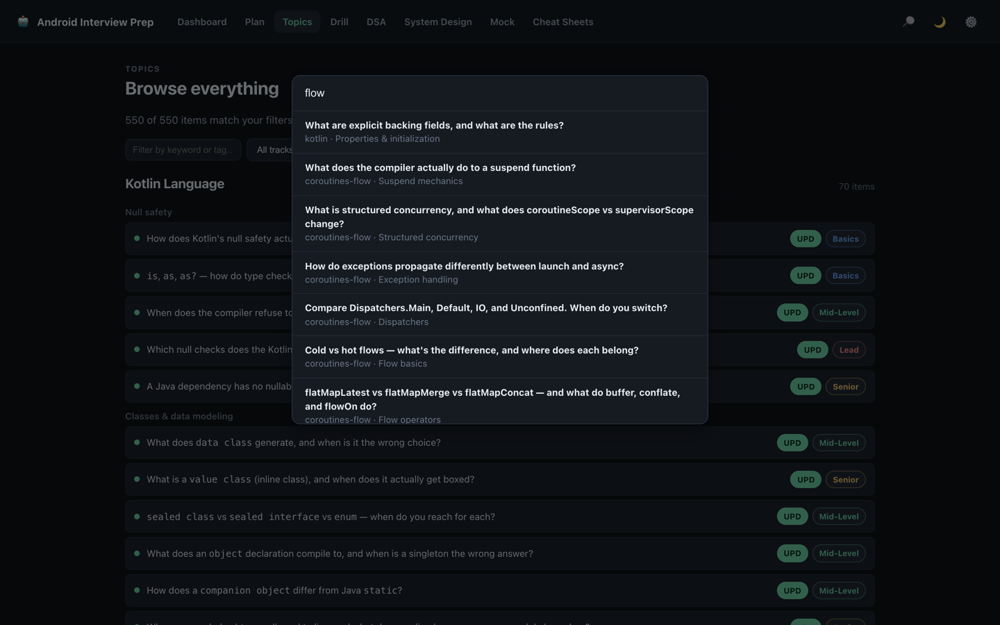

### ⚙️ Settings — your date, your data

Interview date, theme, and **export/import your progress as JSON** — that's how you move to another
laptop or keep a backup. Nothing you do here is sent anywhere.

---

## How to get the most out of it

### The daily loop

```
Dashboard  →  clear what's due  →  today's plan tasks  →  say each answer out loud  →  Mark complete
```

Clear the **due** queue before touching new material. Due items are the things you're about to
forget; new reading can wait a day, forgetting can't.

### Five rules that decide whether this works

1. **Read the short answer first.** If you can already deliver it, mark it and move on. The library
   is far too big to read front to back, and it was never meant to be read that way.
2. **Say it out loud. Every time.** Reading an answer and performing one are different skills, and
   only one of them is tested. Silent nodding feels like progress and isn't.
3. **Rate honestly.** *Mark complete* means "I said that, unprompted, and it was good." A card you
   fake today comes back a month from now — exactly when it's too late to help you.
4. **Read the traps even when you know the answer.** That section is the difference between a
   correct answer and a convincing one.
5. **Don't skip the follow-ups.** Half of interview damage happens on the second question, not the
   first.

### Once you're past the halfway mark, perform instead of read

Every day from then on, do at least one of these *with the clock running*:

- A **system design** scenario, out loud, standing up, no notes. Clarify first.
- A **DSA problem** typed into the scratchpad and actually **Run** — writing Kotlin that compiles is
  a separate muscle from recognizing the pattern.
- A **mock round**, timer visible.

### The day before

Skim and print the **Cheat Sheets**, re-drill only what's due, do one full **Mock** loop if you have
the time, then stop. Cramming new material the night before mostly costs you the sleep that would
have made the rest of it available.

### The morning of

Open the cheat sheets. Read your own **notes** on the items that tripped you up. Do not start
anything new.

### Ways people waste this

| Anti-pattern | Do this instead |
|---|---|
| Reading the long answer for everything | Short answer first; go deep only where you hesitated |
| Marking everything complete to feel productive | Rate what you actually said; the schedule pays you back for honesty |
| Studying only your strong track | The dashboard sorts mastery for you — feed the low bars |
| Peeking at DSA solutions early | Hints one at a time, solution last |
| Reading system design answers instead of speaking them | Timer on, checklist ticking, out loud |
| Leaving mocks until the last day | One a week from the start, then more |

### Keyboard

| Key | Does |
|---|---|
| <kbd>/</kbd> | Open search from anywhere |
| <kbd>Esc</kbd> | Close search |
| <kbd>j</kbd> / <kbd>k</kbd> | Next / previous item |
| <kbd>Space</kbd> | Reveal the answer in a drill card |

---

## Your progress is yours

- It lives **in your browser**, on your machine. No account, no analytics, no telemetry.
- **Content updates can never disturb it** — your ratings, notes, plan ticks and mock history are
  keyed to permanent item ids and kept entirely separate from the library itself.
- An update **never lands in the middle of a drill or a mock**.
- **Back it up or move it:** Settings → *Export progress* writes a JSON file; *Import* restores it on
  another machine.
- Using a different browser or a private window means a different, empty copy — study in the same one.

---

<p align="center"><sub>
Built to be used at 7am on the morning of an interview: no login, no setup, no network required.<br>
<a href="https://nadernabil216.github.io/InterviewPrep/">nadernabil216.github.io/InterviewPrep</a>
</sub></p>
